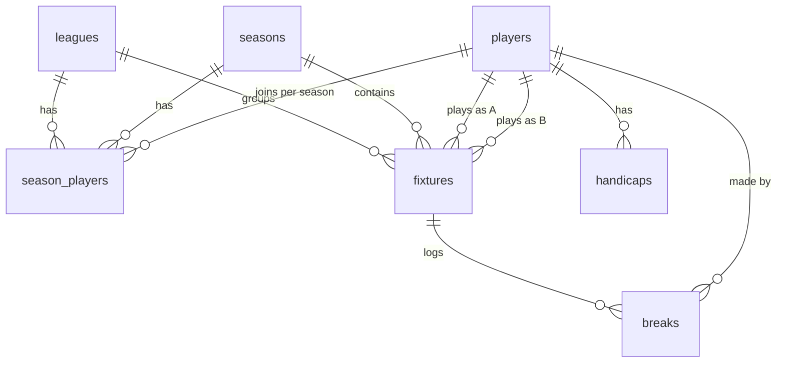

# Supabase Backend - Setup & Operations

The site reads its data from a Supabase Postgres database (project `Apps`,
ref `yzyipxvlsoxfphwobfkb`) via a single Edge Function called
`crossguns-api`. The legacy Google-Sheets backend has been retired; data
edits happen either through the in-site Admin Mode or directly in the
Supabase Table Editor.

## Architecture

```
Browser (static HTML)
   |  GET ?action=...&season=...
   v
Edge Function: crossguns-api  (supabase/functions/crossguns-api/index.ts)
   |  direct Postgres connection (SUPABASE_DB_URL)
   v
schema: crossguns
   |-- leagues           (Group 1, Group 2, Group 3)
   |-- seasons           (one row per season; one is_current = true)
   |-- players           (identity only)
   |-- season_players    (per-season league membership)
   |-- fixtures          (season + league + round + stage + scores)
   |-- handicaps         (full history per player)
   +-- breaks            (big breaks per fixture per player)

   views:
   |-- fixture_results_v     (one row per (fixture, player) for completed league play)
   |-- league_standings_v    (P/W/L/D/+-/Pts per (season, league, player))
   |-- head_to_head_v        (record between every ordered pair, used for tiebreaks)
   +-- max_adjusted_break_v  (raw break + handicap on match date, raw value >= 25)
```

The schema is **not** added to the project's "Exposed schemas" list, so it
can't be queried directly via PostgREST. The Edge Function uses a direct
Postgres connection via `SUPABASE_DB_URL`, keeping all data inside the
`crossguns` namespace and away from anonymous clients.

## Data model



### Standings calculation

`league_standings_v` is computed live from `fixtures` whenever it's read.
Rules baked into the view:

- Only `stage = 'league'` fixtures with both `score_a` and `score_b` set count.
- **Pts = frames won** (1 point per frame won). E.g. a 2-1 win is worth 2 pts
  to the winner and 1 pt to the loser; a 2-0 win is worth 2 pts and 0 pts.
- `frame_diff = sum(frames_for) - sum(frames_against)`.
- `W` / `L` / `D` count match outcomes (frames_for vs frames_against) and are
  used purely as the tiebreaker chain - they do not contribute to `Pts`.

Walkovers are recorded as 2-0; double-walkovers as 0-0 (zero points to both),
matching how the league has historically scored them.

### Standings ordering (CrossGuns tiebreak chain)

The Edge Function (`applyCrossgunsTiebreak`) orders each group as follows:

1. `points` desc
2. `frame_diff` (`+/-`) desc
3. `won` desc
4. **head-to-head** as a mini-league among players still tied: match wins
   between only the tied players, then frame diff between only the tied
   players.
5. **max adjusted break** for the season + league: greatest value of
   `raw_break + handicap_on_match_date` where `raw_break >= 25`
   (`max_adjusted_break_v`).
6. Otherwise alphabetical by player name (stable).

Players in `season_players` who haven't played a league fixture yet show
up with all-zero rows.

## File map

| Where                                            | What it does                                                     |
| ------------------------------------------------ | ---------------------------------------------------------------- |
| `supabase/migrations/*.sql`                      | DDL applied via `supabase db push` or the `apply_migration` MCP. |
| `supabase/functions/crossguns-api/index.ts`      | Edge Function source.                                            |
| `supabase/config.toml`                           | Pins the function to the project and disables JWT.               |
| `assets/js/config/app-config.js`                 | The function URL the frontend uses.                              |
| `assets/js/utils/api-client.js`                  | Browser-side wrapper around `fetch` for the function.            |
| `scripts/migrate-sheets-to-supabase.mjs`         | One-shot data migration from the legacy Google Sheets.           |
| `scripts/verify-migration.mjs`                   | Smoke test for each Edge Function action.                        |
| `docs/plans/`                                    | Architectural plans (versioned alongside the code).              |
| `docs/SUPABASE_MULTI_SCHEMA_MIGRATIONS.md`       | Shared-project / multi-schema migration strategy (Apps + ierne). |

## API contract

### GET actions

Read-only GETs require no custom headers. Default season is the row in
`seasons` with `is_current = true`. Override with `?season=<id>`.

| Action          | Query params                          | Returns                                                                                                               |
| --------------- | ------------------------------------- | --------------------------------------------------------------------------------------------------------------------- |
| `getFixtures`   | `season`                              | `{ success, season, fixtures: [{ fixtureId, playerAId, playerBId, "Game Week", "League", "Stage", "Player A", "Player B", "Match Date", "Result", scoreA, scoreB, sortOrder }] }` |
| `getStandings`  | `season`                              | `{ success, season, leagues: [{ leagueId, name, rows: [{ "Player Name", P, W, L, D, "+/-", Pts }] }] }` |
| `getHandicaps`  | -                                     | `{ success, handicaps: [...], latest: [...] }`. Rows include `handicapId`, `playerId`, plus `"Player Name"`, `"Handicap"`, `"Handicap Date"`. |
| `getPlayers`    | `season`, `league`                    | `{ success, season?, players: [{ playerId, playerName, league?, active }] }`. No params -> every player; with params -> just that season's roster. |
| `getTopBreaks`  | `season`, `league`, `limit` (def 20)  | `{ success, season, breaks: [{ breakId, fixtureId, playerId, "Player Name", "Break", "League", "Stage", "Round", "Match Date", "Opponent" }] }`. The frontend filters to raw value >= 25 and annotates each entry with the handicap delta. |
| `getSeasons`    | -                                     | `{ success, seasons: [{ seasonId, name, startsOn, endsOn, isCurrent }] }` |
| `getLeagues`    | -                                     | `{ success, leagues: [{ leagueId, name, displayOrder }] }` |
| `getBreaksForFixture` | `fixtureId` (uuid)              | `{ success, fixtureId, breaks: [{ breakId, playerId, value }] }` |

### POST actions (admin writes)

Mutations use `POST` with `Content-Type: application/x-www-form-urlencoded`
and a single field `data` whose value is JSON:

`{ "action": "<name>", "data": { ... }, "adminToken": "<optional>" }`

CORS stays "simple" (no preflight), matching the public site rules.

1. Call **`adminLogin`** with `{ "pin": "<same value as secret>" }` (no
   `adminToken`). On success the response includes `token` and `expiresAt`.
2. Send `adminToken` on subsequent POSTs (stored in `sessionStorage` under
   `crossgunsAdminToken` after you use **Unlock Admin Mode** in the site
   menu).

Set **`CROSSGUNS_ADMIN_SECRET`** on the Edge Function (Dashboard -> Edge
Functions -> `crossguns-api` -> Secrets). Use a long random string or a
club PIN; rotating it invalidates existing tokens. If the secret is unset,
`adminLogin` returns an error and mutations return `401 Unauthorized`.

| Action                 | `data` fields (summary) |
| ---------------------- | ----------------------- |
| `adminLogin`           | `pin` or `secret` |
| `upsertPlayer`         | `playerId`, `playerName`, `active` (optional, default true) |
| `upsertSeasonPlayer`   | `seasonId`, `playerId`, `leagueId`; or `remove: true` to drop membership |
| `upsertHandicap`       | `playerId`, `handicap`, `effectiveDate`; optional `handicapId` to update |
| `upsertSeason`         | `seasonId`, `name`, optional `startsOn`, `endsOn`, `isCurrent` |
| `upsertLeague`         | `leagueId`, `name`, `displayOrder` |
| `upsertFixture`        | optional `fixtureId`; `seasonId`, `stage` (`league` \| `knockout`), `roundLabel`, `playerAId`, `playerBId`; `leagueId` required when `stage` is `league`; optional `matchDate`, `sortOrder`, `scoreA`, `scoreB` |
| `updateFixtureResult`  | `fixtureId`, `scoreA`, `scoreB` (null/empty allowed per league rules); optional `matchDate` (`YYYY-MM-DD`) - omit to leave `match_date` unchanged |
| `upsertBreak`          | optional `breakId`; `fixtureId`, `playerId`, `value` (1-155) |
| `deleteBreak`          | `breakId` |
| `deleteFixture`        | `fixtureId` (uuid) |
| `deleteHandicap`       | `handicapId` (uuid) |
| `deletePlayer`         | `playerId` - rejected with `409` if referenced by fixtures or breaks |
| `deleteSeason`         | `seasonId` - rejected with `409` if any fixtures use the season (roster rows cascade with the season) |
| `deleteLeague`         | `leagueId` - rejected with `409` if referenced by fixtures or `season_players` |

Errors return `{ success: false, error: "..." }` with HTTP 4xx/5xx.

## Setup from scratch

If you ever need to recreate this from a fresh Supabase project:

1. **Apply migrations** (idempotent):
   - `supabase db push` (CLI, after `supabase link --project-ref <ref>`), or
   - use the `apply_migration` MCP tool with the SQL in
     `supabase/migrations/`.
   - On the shared **Apps** project, `db push` from this repo often fails
     because ierne-snooker uses the same project; see
     [`SUPABASE_MULTI_SCHEMA_MIGRATIONS.md`](SUPABASE_MULTI_SCHEMA_MIGRATIONS.md).

2. **Deploy the function** (required after any change to `index.ts`):
   - `supabase functions deploy crossguns-api --no-verify-jwt`, or
   - use the `deploy_edge_function` MCP tool. `SUPABASE_DB_URL` is provided
     automatically by the platform. For write APIs from the site
     (**Unlock Admin Mode**), add secret **`CROSSGUNS_ADMIN_SECRET`**
     (see API contract above).

3. **Update `assets/js/config/app-config.js`** with the new function URL.

4. **Migrate data** from the legacy Google Sheets:
   ```
   npm install
   cp .env.example .env       # then edit values
   npm run migrate:dry-run    # check counts and warnings
   npm run migrate            # live load
   ```

5. **Verify** the function returns the expected data:
   ```
   CROSSGUNS_API_URL=https://<ref>.functions.supabase.co/crossguns-api npm run verify
   ```

6. **Smoke test the site** by opening each page and confirming data renders:
   - `index.html` (group leaders for Group 1 / 2 / 3)
   - `leagues.html` (three monospaced standings tables)
   - `fixtures.html` (upcoming, where Result is empty)
   - `results.html` (where Result is set)
   - `handicaps.html` (latest per player)
   - `top-breaks.html` (adjusted breaks >= 25)
   - Admin pages (after unlocking): `admin-fixtures.html`,
     `admin-players.html`, `admin-league-seasons.html`.

## Editing data

Three options:

- **Unlock Admin Mode** (menu, bottom item): enter the same value as
  `CROSSGUNS_ADMIN_SECRET`, then use admin-only UI: **fixture** results on
  [`fixtures.html`](../fixtures.html), and master-data pages
  [`admin-fixtures.html`](../admin-fixtures.html),
  [`admin-players.html`](../admin-players.html),
  [`admin-league-seasons.html`](../admin-league-seasons.html). Menu links
  appear only while Admin Mode is unlocked.
- **Via the Supabase dashboard** Table Editor on the `crossguns` schema.
- **Re-run the migration script** after the source Google Sheets are
  updated. Inserts are upserts keyed on stable identifiers (player slug,
  `(season_id, stage, round_label, player_a_id, player_b_id)`,
  `(player_id, effective_date)`, `(season_id, player_id)`), so re-runs are
  safe.

### Adding a new season

1. Insert a new `seasons` row, set `is_current = true` (the migration
   script clears `is_current` from every other season automatically).
2. Insert `season_players` rows for the players in each group for the
   season.
3. New fixtures get `season_id = '<new>'`. Standings views automatically
   only consider that season's fixtures when filtered.

### Adding a new league group

Insert a row in `leagues` with the desired `league_id` (string) and
`display_order`. The `getStandings` action returns leagues in
`display_order`. The frontend renders only the three configured group IDs
(`1`, `2`, `3`) on `leagues.html` and `index.html`; additional groups
would need their own DOM containers.

## Known gaps / follow-ups

- **Seasonal handicaps**. `handicaps` is global (player + effective date),
  not scoped per season. Add a `season_id` column if season-specific
  handicaps become a requirement.
- **Archive table for closed seasons**. The views handle historical reads
  fine as long as fixtures stay in place; an explicit archive (frozen
  end-of-season standings) would only be needed if you're worried about
  ever deleting old fixtures.
