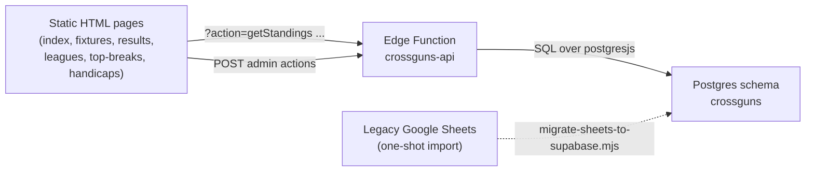

# CrossGuns: from Publii + Google Sheets to Static + Supabase

> Status: implemented. The Publii build is preserved at the
> `pre-supabase-migration` git tag.

## Why

The previous CrossGuns site was built with Publii and stored all league
data in public Google Sheets. The Publii template owns 99% of the build
output, so the GitHub repo (`ZarleyLtd/CrossGunsSnooker`) had no useful
diff history and any change required spinning up the Publii desktop app.
Reads were also slow: every page hit the sheet through `gviz` and parsed
CSV in the browser.

The replacement keeps the look and feel of the existing public site,
moves all data into Supabase, and renders pages from a small Edge
Function so the whole repo becomes editable in plain HTML/CSS/JS.

## Architecture



- The browser only ever talks to `crossguns-api`. There is no direct
  PostgREST / supabase-js access from the public site.
- The schema `crossguns` is **not** exposed via PostgREST. The Edge
  Function uses a direct Postgres connection.
- Admin Mode is gated by an HMAC token derived from
  `CROSSGUNS_ADMIN_SECRET`. The PIN never leaves the function.

## Differences from the ierne-snooker template

CrossGuns reused the ierne-snooker codebase as a starting point. The
behaviours below were re-implemented to match the legacy CrossGuns
Publii build, because the user's success criterion was "the public
pages should look almost identical, just faster".

| Page              | CrossGuns behaviour (kept)                                                                                                                     |
| ----------------- | ---------------------------------------------------------------------------------------------------------------------------------------------- |
| `index.html`      | 3 group leaders (`#g1-leader` / `#g2-leader` / `#g3-leader`). No knockout panel. Ties on Pts/+/-/W render as "Name A & Name B (tied)".         |
| `fixtures.html`   | Radio filter All / Group 1 / Group 2 / Group 3. Upcoming-only, grouped by Game Week. Admin "V" button opens the result dialog.                 |
| `results.html`    | Same filter. Only fixtures with a recorded score. Winner (score = 2) bolded. Admin `[score]` re-opens the result dialog.                       |
| `leagues.html`    | Three monospaced `<pre>` blocks (`#league-a` / `#league-b` / `#league-c`) using server-side tiebreak ordering.                                 |
| `top-breaks.html` | Adjusted breaks only when `raw >= 25`. Shows annotation `[raw plus delta]` or `[actual break]`. Same group filter.                             |

The tiebreak ordering in `applyCrossgunsTiebreak` is the full CrossGuns
chain: Pts -> +/- -> W -> mini-league H2H -> max adjusted break -> name.

## Migration steps (already executed)

1. **Backup local Publii fragments** to
   `C:\CursorSites\PubliiCrossguns-fragments-backup`. Clone the existing
   `ZarleyLtd/CrossGunsSnooker` GitHub repo into the workspace.
2. **Tag** `origin/main` as `pre-supabase-migration` so we can revert.
3. **Schema migration**:
   `supabase/migrations/20260518161615_create_crossguns_schema.sql`
   creates the `crossguns` schema, all tables, RLS, the four views, and
   seeds Group 1 / 2 / 3 plus the current `spring-26` season.
4. **Edge Function**:
   `supabase/functions/crossguns-api/index.ts` ports the ierne API,
   swaps the schema, and adds the adjusted-break tiebreaker.
5. **Frontend**: rebuild the public + admin pages and adapt the JS
   modules in `assets/js/{config,utils,components,pages,main.js}`.
   Tokens / event names use the `crossguns` prefix
   (`crossgunsAdminToken`, `crossguns-admin-mode-changed`).
6. **Data import**: `node scripts/migrate-sheets-to-supabase.mjs
   --dry-run` then `npm run migrate`. Idempotent; safe to re-run after
   any sheet edits made between cutover and verification.
7. **Secrets**: set `CROSSGUNS_ADMIN_SECRET` on the Edge Function. The
   value is the PIN admins type into "Unlock Admin Mode".
8. **Clean up legacy Publii artefacts** (`authors/`, `tags/`, `media/`,
   `backup-page.html`, `feed.json`, `feed.xml`, `sitemap.xsl`, old
   theme assets). Regenerate `sitemap.xml`.
9. **Push**: commits + `pre-supabase-migration` tag to
   `ZarleyLtd/CrossGunsSnooker:main`. GitHub Pages republishes from the
   same repo with no workflow changes (static files at repo root).
10. **Rename workspace**: optional `git mv` of the local clone to
    `CrossGuns-snooker` after push. The remote name does not change.

## Rollback

If the new build needs to be reverted:

```
git checkout pre-supabase-migration -- :/.
```

This restores the entire Publii export. The Supabase data stays put -
the legacy site doesn't read from it, and the Google Sheets remain the
canonical source until the migration script is re-run.

## Open follow-ups

- Decide whether to keep the legacy Google Sheets as a read-only mirror
  or shut them down once the spring-26 season is finished.
- Add a season selector to the admin pages once we have more than one
  season in the database.
